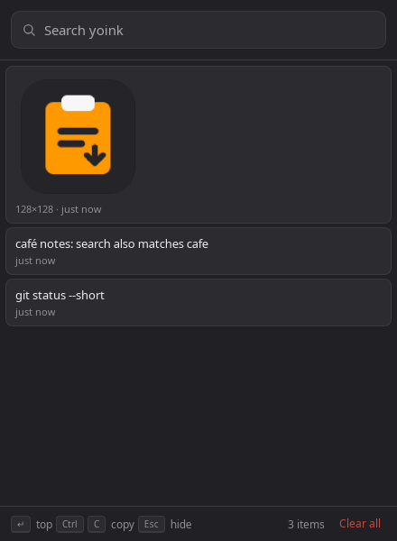

# yoink

A small clipboard history manager for Linux on X11. It keeps text and images
you copy, searches them, and puts an item back on the clipboard when you pick it.
Built for personal use on Linux Mint 22.3 with Cinnamon.

I wanted a smaller alternative to CopyQ. Text, images, search, and a shortcut
owned by the desktop environment are the scope.



**Platform:** Linux x86_64, X11 with XFixes, GTK3, WebKitGTK 4.1, and a session
D-Bus connection. A StatusNotifierWatcher is needed for the tray. Native
Wayland, macOS, and Windows are not supported.

**Privacy:** clipboard history is stored unencrypted on your computer.
Passwords and tokens can enter history unless the copying application marks
them as secret. Read [Storage and privacy](#storage-and-privacy) before use.

## Install

Install the latest release into `~/.local`:

```sh
curl --proto '=https' --tlsv1.2 -fsSL \
  https://raw.githubusercontent.com/garyj/yoink/main/install.sh | sh
~/.local/bin/yoink --version
```

Pass `--version 0.1.0` to install a specific release or `--prefix /absolute/path`
to use another installation prefix:

```sh
curl --proto '=https' --tlsv1.2 -fsSL \
  https://raw.githubusercontent.com/garyj/yoink/main/install.sh | \
  sh -s -- --version 0.1.0
```

The installer verifies the release archive against its published SHA-256
checksum. It installs the executable, desktop entry, icon, README, source
commit identifier, and licence notices. To remove those files while keeping
clipboard history and configuration:

```sh
curl --proto '=https' --tlsv1.2 -fsSL \
  https://raw.githubusercontent.com/garyj/yoink/main/install.sh | \
  sh -s -- --uninstall
```

Alternatively, use mise's built-in
[GitHub backend](https://mise.jdx.dev/dev-tools/backends/github.html):

```sh
mise use -g github:garyj/yoink@0.1.0
mise exec github:garyj/yoink@0.1.0 -- yoink --version
mise reshim
```

No custom mise plugin is needed. These examples use `garyj/yoink`; forks need
their own repository name. Use a current mise version with the GitHub backend.

On Ubuntu 22.04 and compatible distributions, install the runtime libraries:

```sh
sudo apt install libgtk-3-0 libwebkit2gtk-4.1-0
```

Newer Ubuntu releases may name the GTK package `libgtk-3-0t64`. The binary
dynamically links these libraries. The installer and mise do not install them.

You can also download `yoink-v0.1.0-x86_64-unknown-linux-gnu.tar.gz` and
`SHA256SUMS` from the GitHub Release, then extract them in an empty directory:

```sh
sha256sum --check --ignore-missing SHA256SUMS
tar -xzf yoink-v0.1.0-x86_64-unknown-linux-gnu.tar.gz
./yoink --version
```

The expected output is `yoink 0.1.0`. Keep the licence files with the binary.

## Start and summon

Run `yoink` in your graphical session. It starts hidden and captures the
clipboard. Run it again, or click the tray icon, to show the window.
Further invocations toggle the same instance.

In Cinnamon, open **System Settings**, **Keyboard**, **Shortcuts**, then
**Custom Shortcuts**. Bind your chosen key to the full path of the executable.
The installer places it here by default:

```text
/home/YOUR_USER/.local/bin/yoink
```

For a mise installation, use the stable shim path after `mise reshim`:

```text
/home/YOUR_USER/.local/share/mise/shims/yoink
```

Replace `YOUR_USER` with your username. If you set `MISE_DATA_DIR`, use its
`shims/yoink` path instead. Test that exact command from the desktop shortcut.
Add the same command to startup applications to capture clipboard history
from login. There is no built-in global shortcut.

Quit from the tray menu or run `yoink --quit`. The close button and Escape
hide the window without stopping capture. The window stays open when focus
moves elsewhere.

After an upgrade, quit the old process and start yoink again. Installing a
new version does not replace the running process.

## Use the window

| Action | Result |
| --- | --- |
| Type in search | Filters text, ignoring case and accents |
| Enter in search | Copies the first result and hides the window |
| Select a card, then Ctrl+C | Copies that item and hides the window |
| Ctrl+C inside search | Copies the selected search text normally |
| Double-click a card | Copies that item and hides the window |
| Hover or focus a card, then select its X | Removes it from history |
| Newer or Older | Browses another page of retained items |
| Clear all, then Sure? | Removes all saved history |
| Escape | Hides the window |

Copying an existing item moves it to the top without a duplicate. Images
appear when the search is empty. Text previews are shortened, but copying
uses the full stored text. Read, copy, and deletion failures appear in the
window. A clipboard write must succeed before a successful copy hides it.

## Configure

The optional config file is `~/.config/dev.garyj.yoink/config.toml`:

```toml
max_items = 500
```

Restart yoink to apply changes. Lowering the limit removes the oldest items
beyond it at startup. A limit of zero stores nothing and removes existing
history. Invalid values or unknown keys prevent startup and print an error
to stderr.

`XDG_CONFIG_HOME` and `XDG_DATA_HOME` override the corresponding default
directories. The `dev.garyj.yoink` identifier stays fixed so upgrades retain
existing history.

## Storage and privacy

History lives in `~/.local/share/dev.garyj.yoink/history.sqlite`. The app
sets its data directory to mode `0700` and the database to `0600`, including
existing installations. It does not upload clipboard contents or add telemetry.

yoink skips clipboard data marked `x-kde-passwordManagerHint=secret`, which
some password managers provide. An application that omits the marker can
still put sensitive content in history. Clearing the system clipboard later
does not remove an item already saved in yoink.

Deletion overwrites deleted SQLite content with secure deletion enabled.
Clear all also compacts the database to remove previously freed pages.
This cannot erase copies in backups, filesystem snapshots, swap, or storage
hardware. **Clearing history does not clear the system clipboard.**

Quit yoink before manually replacing or removing the database file. A
database from a newer, unsupported schema is rejected without rewriting it.

Capture limits are 1 MiB of UTF-8 text, 64 MiB of decoded RGBA pixels,
8192 pixels per image dimension, and 10 MiB per encoded PNG. Oversized
content is skipped and logged to stderr. arboard must receive clipboard data
before these limits can be checked, so the limits are not a hard bound on
memory used during the initial clipboard transfer. Data is fetched on X11
ownership changes, rather than repeatedly decoding an unchanged clipboard.

## Build from source

Install Rust through [rustup](https://rustup.rs), which reads the pinned
`rust-toolchain.toml`. The tested toolchain is Rust 1.98.0. Install Bun 1.4.0
directly or run `mise install` in this repository.

On Ubuntu or Debian derivatives, install the build libraries:

```sh
sudo apt install libwebkit2gtk-4.1-dev build-essential curl file \
  libxdo-dev libssl-dev librsvg2-dev libdbus-1-dev
bun install --frozen-lockfile
bun run tauri build --no-bundle -- --locked
```

The executable is `target/release/yoink`. Always build releases through the
Tauri CLI. A bare `cargo build --release` does not enable embedded assets
and makes the webview look for the development server.

For development, run `bun run tauri dev`. The app starts hidden here too.
Click the tray icon or run `target/debug/yoink` in another terminal to summon
it. Development uses the same data directory unless you set different XDG
directories before starting the process.

Other distributions' build prerequisites are listed in the
[Tauri documentation](https://v2.tauri.app/start/prerequisites/).

## Develop and test

`crates/yoink-core` owns SQLite persistence, search, retention, migrations,
and config parsing. It has no GUI dependencies. The Tauri runtime owns the
tray and commands; `src-tauri/src/clipboard.rs` owns clipboard access and
X11 change tracking. `src/routes/+page.svelte` is the UI.

Run the configured checks:

```sh
cargo fmt --all --check
cargo clippy --locked --workspace --all-targets -- -D warnings
cargo test --locked --workspace
bun run check
```

With `xvfb` and `xclip` installed, run the clipboard integration tests on their own X server:

```sh
xvfb-run -a cargo test --locked --workspace x11_ -- --ignored --test-threads=1
```

The integration test changes its display's clipboard, so do not run it
against your normal desktop. On machines without the GUI development
libraries, `cargo test --locked -p yoink-core` runs the storage tests alone.

`just check` wraps formatting, Clippy, tests, and Svelte checks. There is no
separate ESLint configuration or automated frontend test suite. Exercise
changed UI behavior in the real WebKitGTK app before release.

See [dependency review notes](docs/dependencies.md) for known upstream
advisories and [the release guide](docs/releasing.md) for packaging and
publishing. Read [AGENTS.md](AGENTS.md) before changing clipboard ownership
or window focus behavior.

## Licence

GPL-3.0-or-later. See [LICENSE](LICENSE) and [NOTICE.md](NOTICE.md). The licence
choice conservatively covers potential CopyQ adaptations identified by the
existing source notes. Studying CopyQ's behavior alone does not require GPL.
